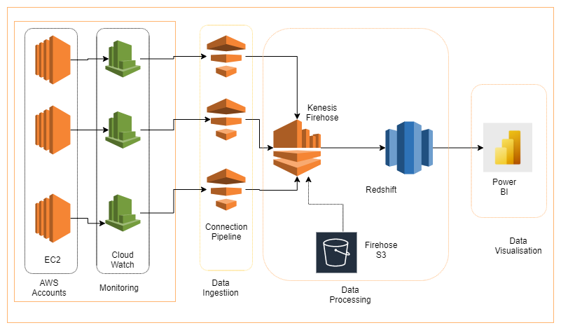

# Monitoring Dashboard

## Overview

This solution's main objective was to provide accurate monitoring of metrics data generated from services like EC2 / RDS / S3 and stream that data to RedShift by using the Cloudwatch Metrics Stream service and Kinesis Firehose delivery streams. 

The data in the RedShift cluster is then visualized by PowerBI.

## Prerequisites

The following metrics were set as required from the customer:
* Availability for EC2 instances; 
* Availability for S3 buckets;
* High CPU Usage (75% warning; 95% critical)
* Ability to see if the resource is in Down status;
* S3 bucket storage consumption – more than 4Tb – critical;
* RDS - 500GB Warning -> 1TB CriticalMemory consumption (best practice);
* CPU utilization 
* DiskReadBytes
* DiskWriteBytes
* DiskReadOps
* DiskWriteOps
* NetworkIn
* NetworkOut
* CPUCreditUsage
* CPUCreditBalance

## Overview

### Namespaces
Based on the prerequisites outlined above the following AWS Namespaces were identified to be in scope:
* EC2
* EBS
* RDS
* S3

Any CloudWatch Metrics available for them are collected within their respective account and region.

### Regions in scope
Based on the resources created in the account Softline has identified the following regions to be in scope:
* AP-NORTHEAST-1
* AP-NORTHEAST-2
* AP-SOUTH-1
* AP-SOUTHEAST-1
* AP-SOUTHEAST-2
* CA-CENTRAL-1
* EU-CENTRAL-1
* EU-NORTH-1
* EU-WEST-1
* EU-WEST-2
* EU-WEST-3
* SA-EAST-1
* US-EAST-1
* US-EAST-2
* US-WEST-1
* US-WEST-2


## Solution Architecture diagram



## Solution Design

### PowerBI dashboard / central RedShift cluster account

CinepolisProdSS AWS account has been defined as the main account housing the Redshift Cluster in the North Virginia "us-east-1" region.

The intermediate S3 bucket (**st-usa-181965160294-cw-streams-s3**) has been created in the same account. It stores the raw metric streams as it comes from Firehose. 

To comply with the retention requirements as defined by the client, a lifecycle rule has been added to the bucket with an expiration period of **365 days**.

In Parallel Amazon Secrets Manager has been used with encryption provided by KMS to store a randomly generated password for the Redshift Cluster (under the name **cwmetrics-redshift-secret**), which is automatically provided to the database during the execution of the code and simultaneous creation of the Redshift Cluster.

The data in the RedShift cluster and in the S3 bucket has also been encrypted at rest by utilizing a Customer Manager Keys provided by the AWS Key Management System (KMS) key (all AWS accounts within the organization have access to this key in order for FireHose to be able to encrypt the data with it during delivery to both RedShift and S3).

In order to deliver the Streams data Firehose needs the RedShift to be publicly available on the Internet. To prevent any malicious access a security group has been put in front of the RedShift cluster, which allows direct networking-level access to the cluster [only from the Firehose IP ranges in each region as defined in the AWS documentation](https://docs.aws.amazon.com/firehose/latest/dev/controlling-access.html#using-iam-rs-vpc).

### Metric and Delivery Streams

In order to gather all data based on the prerequisites a CloudWatch Metric stream has been created in each of the pre-defined [AWS Regions](#regions-in-scope) in every AWS account [listed in this file](../files/backend_config_dirs) with all pre-defined [namespaces](#namespaces) enabled.

The stream destination in the CloudWatch Metric stream is a Kinesis Firehose Delivery stream within the same account and region.

In essence, there are 1 CW metric stream and 1 Kinesis Firehose stream in each of the 16 regions defined in each of the 42 AWS accounts in scope).

The Kinesis Firehose Delivery stream has been set up to send any data it receives from the CloudWatch stream to a RedShift cluster as a destination. 
In order to deliver the data it receives, Firehose is using an intermediate S3 bucket to which it puts the raw data in unstructured JSON format, before it delivers the data to its final destination in RedShift.
To achieve that Firehose is utilizing a COPY option which relies on JSON file path in the bucket which converts the unstructured JSON data to a tabular format in the RedShift database table.

### Additional resources

* IAM roles and respective policies have been created for RedShift, CloudWatch Metrics, and Kinesis Firehose
* Resource policies have been created for KMS, S3 and Secrets Manager

## Solution deployment

The solution is designed to be deployed automatically with the help of a [wrapper script](../scripts/terraform_deploy.sh) which [uses terraform](Prerequisites.md) to [deploy it](Usage.md) automatically in 16 regions within 42 AWS accounts.

### Deployment specifics

#### Main Redshift account

You control the account in which the RedShift cluster will reside by a variable named ```main_redshift_cluster```, which defaults to ```false```. 

For the CinepolisProdSS this variable is overwritten via the ```$PROJECT_SRC_ROOT/backend-config/CinepolisProdSS/config.tfvars``` file and for this account is set to ```true```

In case you decided to redeploy the cluster in another account or create a second cluster in one additional account, you need to do same in the config.tfvars for that specific account.

Once you execute terraform apply in the CinepolisProdSS account you need to populate the following [variables](../monitoring-dashboard/variables.tf) with the resulting values:
* redshift_aws_account_id
* firehose_to_redshift_s3_bucket_name
* redshift_s3_bucket_kms_key_id
* redshift_cluster_jdbcurl
* redshift_secret_arn_suffix

This variables are later utilized as input in each of the other accounts during the creation of the CloudWatch and Firehose Streams

#### Other accounts

#####Adding additional namespaces

In case you need to add additional namespaces to the CloudWatch Metric Stream, you can do so by adding them in the ```--include-filters``` stanza in the [```cloudwatch_metric_stream.tf```](../monitoring-dashboard/modules/cwmetricstream/cloudwatch_metric_stream.tf) file in the following format:
```jsonpath
[{\"Namespace\":\"AWS\/EC2\"},{\"Namespace\":\"AWS\/EBS\"},{\"Namespace\":\"AWS\/RDS\"},{\"Namespace\":\"AWS\/S3\"}]
```